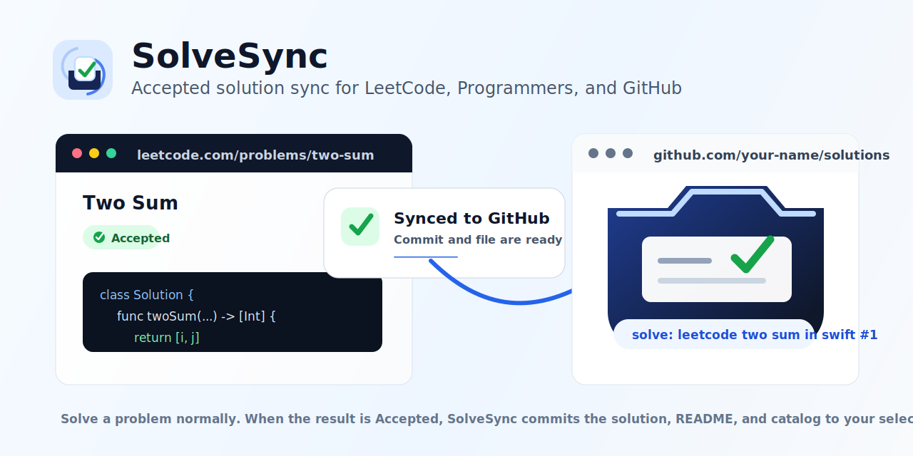

# SolveSync

<p>
  
</p>

SolveSync는 LeetCode와 Programmers에서 Accepted 된 풀이를 사용자가 선택한 GitHub 저장소로 자동 동기화하는 local unpacked Chrome extension입니다.

문제를 푼 뒤 코드를 복사하고, 파일명을 정하고, GitHub에 commit하고, README 진행표를 갱신하는 반복 작업을 줄이기 위한 도구입니다. Accepted 결과가 감지되면 SolveSync가 Solution File, Solution README, Solution Catalog를 한 번의 GitHub commit으로 반영합니다.

<p>
  
</p>

현재 상태는 GitHub Public Preview입니다. Chrome Web Store 배포판이 아니며, 사용자가 이 저장소를 직접 빌드한 뒤 Chrome Extensions에서 `dist`를 `Load unpacked`로 로드해 사용합니다.

## 지원 범위

- LeetCode Accepted Swift/Python3 solution sync
- Programmers Accepted Swift/Python3 solution sync
- GitHub fine-grained PAT 기반 Sync Repository/Sync Branch 선택
- Auto Sync, Sync History, Retry Bundle
- 별도 backend server 없음

지원하지 않는 범위:

- GitHub OAuth 로그인
- Swift/Python3 외 언어 sync
- LeetCode/Programmers 문제 설명 전문 저장
- 일반 수동 sync. Retry는 retry 가능한 실패 항목에만 제공됩니다.

## 설치

```bash
npm install
```

```bash
npm run build
```

Chrome Extensions에서 `dist`를 `Load unpacked`

## GitHub PAT 설정

SolveSync는 GitHub fine-grained personal access token을 권장합니다. PAT는 사용자가 선택한 Sync Repository에 solution commit을 만들기 위해 사용됩니다.

PAT 생성과 관리는 공식 GitHub Docs를 따르세요:
https://docs.github.com/en/authentication/keeping-your-account-and-data-secure/managing-your-personal-access-tokens

권장 권한:

- Repository access: 동기화할 Sync Repository만 선택
- Repository permissions: `Contents: Read and write`
- Repository permissions: `Metadata: Read`

PAT를 만든 뒤 SolveSync Options에서 PAT를 입력하고, Sync Repository와 Sync Branch를 선택한 다음 connection test를 실행하세요.

## 보안과 프라이버시 요약

- PAT는 Chrome extension local storage에 저장됩니다.
- 실패 Retry Bundle은 Accepted solution code를 Chrome extension local storage에 임시 저장할 수 있습니다.
- Solution code는 사용자가 선택한 Sync Repository/Sync Branch로 GitHub sync commit을 만들 때만 전송됩니다.
- LeetCode/Programmers 문제 설명 전문은 저장하지 않습니다.
- SolveSync는 별도 backend server를 운영하지 않습니다.

자세한 내용은 [PRIVACY.md](PRIVACY.md)와 [SECURITY.md](SECURITY.md)를 확인하세요.

## GitHub Support Boundary

GitHub Issue로 받을 수 있는 내용:

- bug report
- docs/install question
- 공개 문서의 누락 또는 부정확한 설명

지원하지 않는 내용:

- 개인 GitHub 계정 설정 대행
- PAT 값 검토
- private repository, LeetCode session, Programmers session 문제의 대리 디버깅
- issue, screenshot, logs에 포함된 secret 분석

Issue를 작성할 때 PAT, token, cookie, session 값, private solution code를 포함하지 마세요.

## License

MIT License. See [LICENSE](LICENSE).
