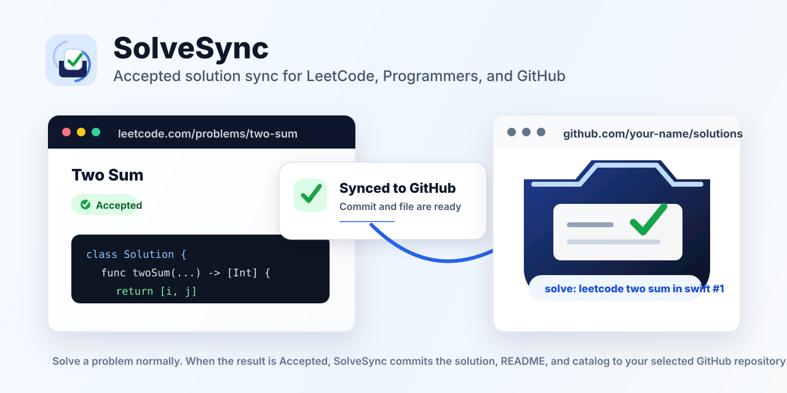

# SolveSync

<p>
  
</p>

SolveSync는 LeetCode, Programmers와 SW Expert Academy(SWEA)에서 Accepted 된 풀이를 사용자가 선택한 GitHub 저장소로 자동 동기화하는 local unpacked Chrome extension입니다.

문제를 푼 뒤 코드를 복사하고, 파일명을 정하고, GitHub에 commit하고, README 진행표를 갱신하는 반복 작업을 줄이기 위한 도구입니다. Accepted 결과가 감지되면 SolveSync가 Solution File, Solution README, Solution Catalog를 한 번의 GitHub commit으로 반영합니다.

<p>
  
</p>

현재 상태는 GitHub Public Preview입니다. Chrome Web Store 배포판은 아니지만, [GitHub Releases](https://github.com/zaehorang/SolveSync/releases)에서 설치용 ZIP을 받을 수 있습니다.

## 다른 사람도 사용할 수 있나요?

네. 별도의 GitHub App을 만들거나 source를 직접 build할 필요 없이 공개 preview를 사용할 수 있습니다.

- 공개 Release ZIP에는 SolveSync가 운영하는 public GitHub App의 공개 client ID와 slug만 포함됩니다. client secret은 포함되지 않습니다.
- 각 사용자는 GitHub 로그인 후 [SolveSync Preview GitHub App](https://github.com/apps/solvesync-preview/installations/new)을 본인이 소유한 repository에 직접 설치합니다.
- 아직 Chrome Web Store 배포판이 아니므로 Chrome의 Developer mode와 `Load unpacked`가 필요합니다.

## 지원 범위

- LeetCode, Programmers, SWEA의 Accepted solution sync
- 지원 언어: Swift, Python3, Java, C++, JavaScript, TypeScript, Kotlin, Go, Rust. 각 Coding Platform이 실제로 제공하는 언어만 해당하며 SWEA는 C++14, JAVA, Python 3 셋뿐입니다
- GitHub App Device Flow 로그인과 App 설치 repository 기반 Sync Repository/Sync Branch 선택
- Auto Sync, Sync History, Retry Bundle
- 별도 backend server 없음

지원하지 않는 범위:

- App이 설치되지 않은 repository와 organization/team workflow
- SWEA의 Contest Problem, User Problem, Code Battle과 모의 테스트
- 지원 Coding Platform의 문제 설명 전문 저장
- 일반 수동 sync. Retry는 retry 가능한 실패 항목에만 제공됩니다.

## 설치

필요한 환경:

- Chrome
- 로그인된 LeetCode, Programmers 또는 SWEA 계정
- 본인이 소유한 GitHub repository

1. [GitHub Releases](https://github.com/zaehorang/SolveSync/releases)에서 최신 preview의 `solvesync-*.zip`을 내려받아 압축을 풉니다.
2. Chrome에서 `chrome://extensions`를 열고 Developer mode를 켭니다.
3. `Load unpacked`를 누르고 압축을 푼 폴더를 선택합니다. 폴더 바로 아래에 `manifest.json`이 있어야 합니다.
4. SolveSync Options에서 `Sign in with GitHub`를 누르고 GitHub에 표시된 일회용 code를 승인합니다.
5. `Install or configure GitHub App`을 눌러 동기화할 본인 소유 repository만 선택합니다.
6. Options로 돌아와 Sync Repository와 Sync Branch를 선택하고 connection test를 실행합니다. Connection test는 commit을 만들지 않습니다.

Chrome에서 확장 폴더를 삭제하면 로드할 수 없으므로, 압축을 푼 폴더는 계속 보관하세요.

### GitHub App 쓰기 권한 오류

동기화 실패 상세에 `POST .../git/blobs: Resource not accessible by integration`이 표시되면 GitHub 로그인 문제가 아니라, 설치된 GitHub App에 `Contents: Read and write` 권한이 적용되지 않은 상태입니다.

GitHub의 `Settings → Applications → Installed GitHub Apps → SolveSync Preview → Configure`에서 다음을 확인하세요.

1. 대기 중인 권한 변경 요청이 있으면 승인합니다.
2. Repository access에 동기화할 repository가 포함되어 있는지 확인합니다.
3. 계속 실패하면 SolveSync Preview App을 제거한 뒤 해당 repository를 선택해 다시 설치하고, SolveSync Options에서 다시 로그인합니다.

GitHub App의 repository 권한을 나중에 추가하거나 확장하면 기존 설치에는 자동으로 적용되지 않으며, 설치 소유자의 별도 승인이 필요합니다. 자세한 내용은 [GitHub의 권한 변경 승인 안내](https://docs.github.com/apps/using-github-apps/approving-updated-permissions-for-a-github-app)를 참고하세요.

## 개발자 빌드

source에서 직접 build하려면 Node.js와 npm이 필요합니다.

```bash
git clone https://github.com/zaehorang/SolveSync.git
cd SolveSync
npm install
cp .env.example .env.local
```

`.env.local`의 `VITE_GITHUB_APP_CLIENT_ID`, `VITE_GITHUB_APP_SLUG`를 사용할 GitHub App의 공개 값으로 바꿉니다. client secret은 필요하지 않으며 입력하면 안 됩니다. maintainer용 등록 절차는 [GitHub App 설정 가이드](docs/GITHUB_APP_SETUP.md)를 따릅니다.

```bash
npm run build
```

Chrome에서 `chrome://extensions`를 열고 Developer mode를 켠 뒤, `Load unpacked`로 생성된 `dist`를 선택합니다.

## GitHub App 설정

Release ZIP 사용자는 GitHub App을 새로 등록할 필요가 없습니다. 직접 배포용 build를 만드는 maintainer만 public GitHub App을 등록합니다.

- Device Flow 활성화
- Expiring user access token 활성화
- Repository permission: `Contents: Read and write`
- Repository permission: `Metadata: Read`
- 다른 사람이 설치할 수 있도록 `Where can this GitHub App be installed?`를 `Any account`로 설정
- 각 사용자는 실제로 동기화할 본인 소유 repository만 App 설치 대상으로 선택

확장을 로드한 사용자는 Options에서 `Sign in with GitHub`를 누르고 일회용 code를 승인한 뒤, `Install or configure GitHub App`으로 동기화할 repository를 선택합니다.

GitHub App 등록과 Device Flow 공식 설명은 [GitHub의 user access token 문서](https://docs.github.com/apps/creating-github-apps/authenticating-with-a-github-app/generating-a-user-access-token-for-a-github-app)를 따르세요.

등록 값, 권한, tester onboarding 절차는 [docs/GITHUB_APP_SETUP.md](docs/GITHUB_APP_SETUP.md)에 정리되어 있습니다.

## 보안과 프라이버시 요약

- GitHub access token과 refresh token은 Chrome extension local storage에 저장됩니다. Device Flow의 pending device code는 session storage에만 저장됩니다.
- 실패 Retry Bundle은 Accepted solution code를 Chrome extension local storage에 임시 저장할 수 있습니다.
- Solution code는 사용자가 선택한 Sync Repository/Sync Branch로 GitHub sync commit을 만들 때만 전송됩니다.
- 지원 Coding Platform의 문제 설명 전문은 저장하지 않습니다.
- SolveSync는 별도 backend server를 운영하지 않습니다.

자세한 내용은 [PRIVACY.md](PRIVACY.md)와 [SECURITY.md](SECURITY.md)를 확인하세요.

## GitHub Support Boundary

GitHub Issue로 받을 수 있는 내용:

- bug report
- docs/install question
- 공개 문서의 누락 또는 부정확한 설명

지원하지 않는 내용:

- 개인 GitHub 계정 설정 대행
- GitHub token 값 검토
- private repository와 Coding Platform session 문제의 대리 디버깅
- issue, screenshot, logs에 포함된 secret 분석

Issue를 작성할 때 access token, refresh token, device code, cookie, session 값, private solution code를 포함하지 마세요.

## License

MIT License. See [LICENSE](LICENSE).
