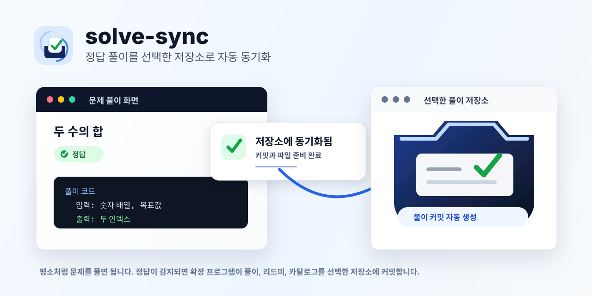

# solve-sync

  

solve-sync는 LeetCode, Programmers와 SW Expert Academy(SWEA)에서 Accepted(정답 판정) 된 풀이를 사용자가 선택한 GitHub 저장소로 자동 동기화하는 Chrome 확장입니다. 현재는 압축을 푼 폴더를 Chrome에 직접 불러오는 방식(local unpacked)으로 설치합니다.

문제를 푼 뒤 코드를 복사하고, 파일명을 정하고, GitHub에 commit하고, README 진행표를 갱신하는 반복 작업을 줄이기 위한 도구입니다. Accepted 결과가 감지되면 solve-sync가 풀이 파일(Solution File), 진행표(Solution README), 진행표의 원본 데이터(Solution Catalog)를 한 번의 GitHub commit으로 반영합니다.

  

현재 상태는 GitHub Public Preview(`v0.1.0-preview.4` 기준)입니다. Chrome Web Store 출시를 준비 중이며, 현재는 [GitHub Releases](https://github.com/zaehorang/solve-sync/releases)에서 설치용 ZIP을 받아 설치합니다.

## 다른 사람도 사용할 수 있나요?

네. 별도의 GitHub App을 만들거나 source를 직접 build할 필요 없이 공개 preview를 사용할 수 있습니다.

- 공개 Release ZIP에는 solve-sync가 운영하는 public GitHub App의 공개 client ID와 slug만 포함됩니다. client secret은 포함되지 않습니다.
- 각 사용자는 GitHub 로그인 후 [solve-sync GitHub App](https://github.com/apps/solve-sync/installations/new)을 본인이 소유한 repository에 직접 설치합니다.
- Chrome Web Store 출시 전까지는 Chrome의 Developer mode와 `Load unpacked`가 필요합니다.

## 지원 범위

- LeetCode, Programmers, SWEA의 Accepted solution sync
- 지원 언어: Swift, Python3, Java, C++, JavaScript, TypeScript, Kotlin, Go, Rust와 SQL 방언 넷(MySQL, Oracle, PostgreSQL, MS SQL Server). 각 Coding Platform이 실제로 제공하는 언어만 해당합니다. SWEA는 C++14, JAVA, Python 3 셋뿐이고, Programmers의 SQL은 MySQL과 Oracle만 지원합니다. 플랫폼별 차이는 [PRD](docs/PRD.md)를 따릅니다
- GitHub 로그인(Device Flow: GitHub 화면에서 일회용 code를 승인하는 방식)과, GitHub App을 설치한 repository 중에서 Sync Repository(동기화할 저장소)/Sync Branch(commit이 쌓일 branch) 선택
- Auto Sync(자동 동기화), Sync History(동기화 기록), Retry Bundle(실패한 동기화를 다시 시도하려고 임시 보관하는 묶음)
- 별도 backend server 없음

지원하지 않는 범위:

- App이 설치되지 않은 repository와 organization/team workflow
- SWEA의 Contest Problem, User Problem, Code Battle과 모의 테스트
- 지원 Coding Platform의 문제 설명 전문 저장
- 일반 수동 sync. Retry는 retry 가능한 실패 항목에만 제공됩니다.

## 설치

필요한 환경:

- Chrome
- 로그인된 LeetCode, Programmers 또는 SWEA 계정
- 본인이 소유한 GitHub repository

1. [GitHub Releases](https://github.com/zaehorang/solve-sync/releases)에서 최신 Release에 첨부된 설치용 ZIP을 내려받아 압축을 풉니다.
2. Chrome에서 `chrome://extensions`를 열고 Developer mode를 켭니다.
3. `Load unpacked`를 누르고 압축을 푼 폴더를 선택합니다. 폴더 바로 아래에 `manifest.json`이 있어야 합니다.
4. solve-sync Options에서 `Sign in with GitHub`를 누르고 GitHub에 표시된 일회용 code를 승인합니다.
5. `Install or configure GitHub App`을 눌러 동기화할 본인 소유 repository만 선택합니다.
6. Options로 돌아와 Sync Repository와 Sync Branch를 선택하고 connection test를 실행합니다. Connection test는 commit을 만들지 않습니다.

Chrome에서 확장 폴더를 삭제하면 로드할 수 없으므로, 압축을 푼 폴더는 계속 보관하세요.

### GitHub App 쓰기 권한 오류

동기화 실패 상세에 `POST .../git/blobs: Resource not accessible by integration`이 표시되면 GitHub 로그인 문제가 아니라, 설치된 GitHub App에 `Contents: Read and write` 권한이 적용되지 않은 상태입니다.

GitHub의 `Settings → Applications → Installed GitHub Apps → solve-sync → Configure`에서 다음을 확인하세요.

1. 설치된 App의 권한에 `Contents: Read and write`가 표시되는지 확인합니다. 대기 중인 권한 변경 요청이 있으면 승인합니다.
2. Repository access에 동기화할 repository가 포함되어 있는지 확인합니다.
3. 계속 실패하면 solve-sync App을 제거한 뒤 해당 repository를 선택해 다시 설치하고, solve-sync Options에서 다시 로그인합니다.

GitHub App의 repository 권한을 나중에 추가하거나 확장하면 기존 설치에는 자동으로 적용되지 않으며, 설치 소유자의 별도 승인이 필요합니다. 자세한 내용은 [GitHub의 권한 변경 승인 안내](https://docs.github.com/apps/using-github-apps/approving-updated-permissions-for-a-github-app)를 참고하세요.

## 소스에서 직접 빌드하기

Release ZIP 대신 소스에서 직접 만들려면 [GitHub App 설정 가이드의 소스 빌드 절](docs/GITHUB_APP_SETUP.md#2-local-build-설정)을 따릅니다. GitHub App 등록과 `.env.local` 설정이 필요하며, Release ZIP 사용자는 필요하지 않습니다. 문서 전체 안내는 [docs/README.md](docs/README.md)에 있습니다.

## 보안과 프라이버시 요약

- GitHub access token과 refresh token은 Chrome extension local storage에 저장됩니다. Device Flow의 pending device code는 session storage에만 저장됩니다.
- 실패 Retry Bundle은 Accepted solution code를 Chrome extension local storage에 임시 저장할 수 있습니다.
- Solution code는 사용자가 선택한 Sync Repository/Sync Branch로 GitHub sync commit을 만들 때만 전송됩니다.
- 지원 Coding Platform의 문제 설명 전문은 저장하지 않습니다.
- solve-sync는 별도 backend server를 운영하지 않습니다.

자세한 내용은 [PRIVACY.md](PRIVACY.md)와 [SECURITY.md](SECURITY.md)를 확인하세요.

## 문의

bug report, 설치 문의, 문서 오류는 GitHub Issue로 받습니다. 지원 범위와 Issue에 넣으면 안 되는 값(token, cookie, session 값, private solution code)은 [SECURITY.md](SECURITY.md)를 따릅니다.

## License

MIT License. See [LICENSE](LICENSE).
