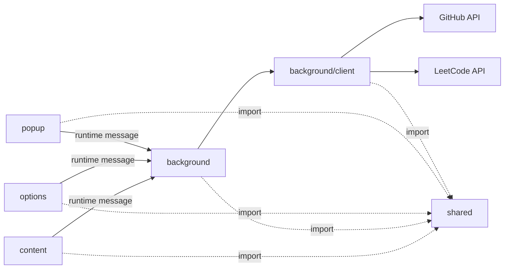
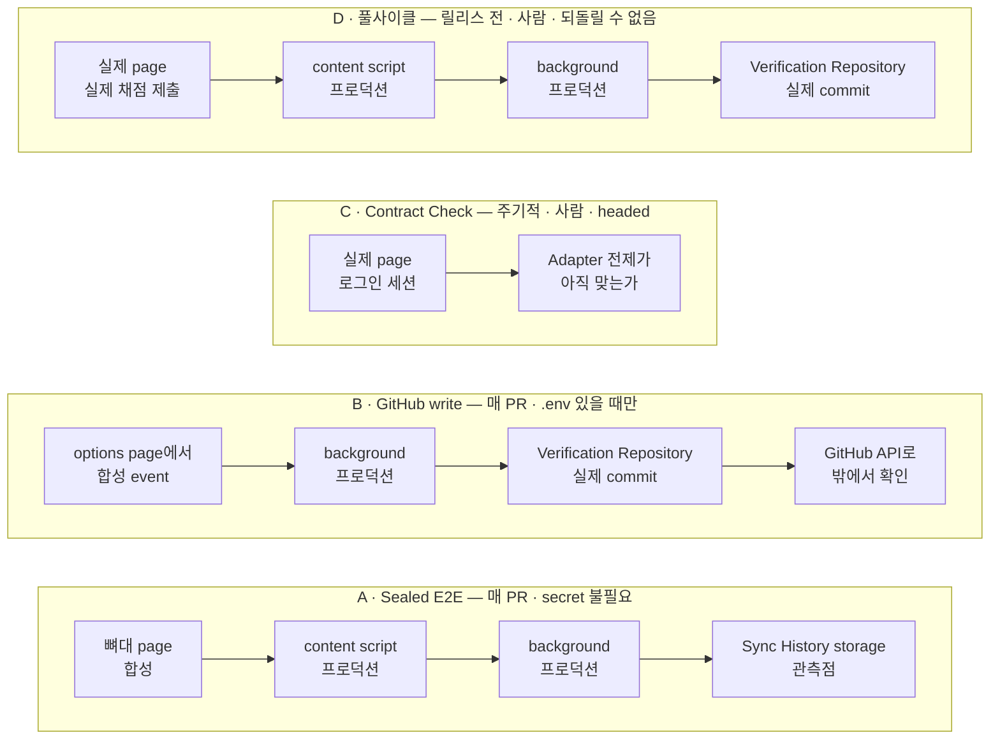
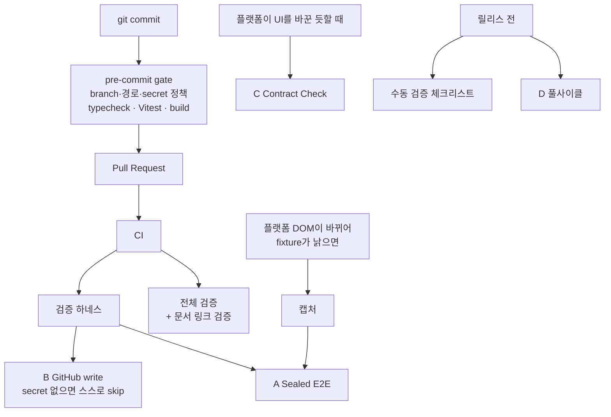

# 아키텍처

> **Description**: 시스템 구조, 모듈 책임, 데이터 흐름, 저장소 모델, 기술 규칙을 정리한 문서다.

## 시스템 개요
SolveSync는 standalone Chrome extension이다. LeetCode, Programmers와 SWEA 문제 페이지를 관찰해 Accepted 제출을 감지하고, 사용자가 선택한 Sync Repository에 Solution File을 커밋한다. 플랫폼별 route, 감지 신호와 source 수집 계약은 [LeetCode 연동](platforms/LEETCODE.md), [Programmers 연동](platforms/PROGRAMMERS.md)과 [SWEA 연동](platforms/SWEA.md)을 따른다.

이 확장은 별도 backend server를 운영하지 않는다. 모든 orchestration은 브라우저 extension runtime 안에서 수행한다.

## Domain Naming Contract
표준 코드/domain 용어는 `CONTEXT.md`를 따른다. TypeScript identifier와 runtime message payload는 `CodingPlatform`, `SyncDeduplicationKey`, `acceptedSourceId`, `SyncRepository`, `SyncBranch`, `SyncHistoryEntry`, `RetryBundle`, `ProgrammersAcceptedEditorSnapshot` 계약을 사용한다. Storage v5는 settings와 GitHub auth session을 분리하고, Solution Catalog v4는 `lastAcceptedSourceId`, `solutionRevisionNumber`, 9개 supported language key를 사용한다.

이전 storage와 runtime payload는 backward-compatible parser로 읽되, 새 write path는 현재 field만 쓴다. v4 settings 안의 legacy PAT는 v5 migration 때 저장 값에서 제거하고 로그인 필요 상태로 전환한다. Runtime message alias는 ingress compatibility 전용이다. 이전 이름과 새 이름의 대응표는 `docs/adr/0026-domain-naming-v4-storage-runtime-and-catalog-migration.md`를 따른다.

## 소스 구조
```text
src/
├── background/      # sync orchestration, Coding Platform source resolver, 외부 API write
│   └── client/      # LeetCode GraphQL, GitHub Sync Repository/Sync Branch/Git Data API 실행 코드
├── content/         # 문제 페이지 관찰, Accepted Editor Snapshot, SWEA MAIN world bridge, toast UI
│   └── platforms/   # Coding Platform Adapter 구현체. route 확정, 전이 판정, payload 조립
├── options/         # GitHub Device Flow, App 설치, Sync Repository/Sync Branch, connection test UI
├── popup/           # Auto Sync 토글, Sync History, failure, Retry Bundle UI
└── shared/          # 타입, Coding Platform policy, mapping, runtime message, Solution README/Catalog, storage schema, 순수 로직

e2e/                 # 검증 하네스. src/ 밖이라 확장 번들에 포함되지 않는다
├── drivers/         # Platform E2E Driver. fixture, 기준 문제, 제출 조작
└── fixtures/        # 실제 page에서 캡처한 sanitized DOM
```

### Module 의존성


## 런타임 컴포넌트
### Content Script
- `https://leetcode.com/problems/*`, `https://school.programmers.co.kr/learn/courses/*/lessons/*`와 `https://swexpertacademy.com/main/solvingProblem/solvingProblem.do*`에서 실행된다.
- Manifest `content_scripts`는 classic script로 실행되므로 content entry는 별도 IIFE bundle인 `dist/content/index.js`로 빌드한다.
- Content bundle에는 static ESM `import`가 남으면 안 되며 `npm run build`의 build verification이 이를 검사한다.
- SWEA 풀이 페이지에는 `world: "MAIN"` bridge bundle `dist/content/sweaEditorBridge.js`를 함께 주입한다. 같은 이유로 별도 IIFE build이며 같은 검증을 받는다([ADR 0035](adr/0035-main-world-editor-bridge-for-swea.md)).
- 일반 `npm run build`는 manifest 선언과 content IIFE를 검증하며 GitHub App 공개 설정이 없는 개발용 build도 허용한다. Release용 `npm run package:chrome`은 Vite의 production 환경에서 `VITE_GITHUB_APP_CLIENT_ID`와 `VITE_GITHUB_APP_SLUG`를 읽고, trim한 값이 하나라도 비어 있거나 placeholder이면 해당 변수명을 포함한 오류로 packaging을 중단한다. 두 공개 설정이 bundle에 포함된 경우에만 Chrome ZIP을 만든다.
- Content event controller가 `MutationObserver`, route lifecycle, 억제 창과 message emission을 소유한다. Content entry는 controller 시작과 toast wiring만 담당한다.
- 플랫폼별 판정은 controller가 아니라 Coding Platform Adapter가 소유한다. Adapter는 route를 확정하고, 관찰 대상을 정하고, 이번 mutation이 fresh Accepted 전이인지 판정하고, Accepted Signal에서 event payload를 조립한다. Controller에는 플랫폼 분기가 없다.
- Adapter를 나눈 이유는 세 플랫폼의 전이 판정이 파라미터가 아니라 **방식**으로 다르기 때문이다. 상세는 [Coding Platform 연동 계약](platforms/README.md#accepted-감지가-갈리는-세-층)을 따른다.
- Accepted 감지는 현재 DOM에 Accepted 상태가 존재하는지가 아니라, Coding Platform adapter가 이번 mutation에서 fresh visible Accepted transition을 확정했는지를 기준으로 한다.
- Route key는 URL이 아니라 adapter가 확정한다([ADR 0036](adr/0036-adapter-resolved-content-route-key.md)). URL로 식별 가능한 플랫폼의 adapter는 계속 URL을 parsing한다.
- Text signal 탐색은 ADR 0022에 따라 mutation 범위 안에서 bounded traversal한다. 플랫폼별 presentation state가 필요하면 같은 observer에 adapter가 등록한 presentation root를 추가 target으로 등록하고 그 root의 visibility attribute만 관찰한다.
- Fresh signal마다 현재 URL을 다시 parsing해 route-bound immutable Accepted event를 즉시 만든다. Event에 DOM source snapshot이 필요하면 이 시점에 한 번만 캡처하고 지연 callback에서 DOM을 다시 읽지 않는다.
- Event는 확정 즉시 전달한다. Coalescing window는 전달을 미루는 지연 창이 아니라 같은 render burst의 후속 signal을 무시하는 억제 창이다([ADR 0037](adr/0037-immediate-accepted-delivery-with-suppression-window.md)). 들고 있는 동안 page가 사라지면 event가 통째로 없어져 실패 기록조차 남지 않는다.
- 비동기로 기다리는 구간은 SWEA bridge 응답뿐이다. Route key가 바뀌면 억제 창과 route-bound adapter state를 폐기하고 현재 batch를 새 route 기준으로 판정한다. 전달 직전에도 route key를 다시 확인한다.
- Fresh transition, immutable event와 route lifecycle 결정은 ADR 0034를 따른다.
- background service worker로 `content:accepted_detected` 메시지를 보낸다.
- 문제 페이지 안에 toast feedback을 렌더링한다.
- GitHub API를 호출하지 않고 sync 상태의 owner도 아니다.

### Background Service Worker
- sync state machine의 owner다.
- runtime listener는 service worker top-level에서 등록한다.
- settings와 Auto Sync 상태를 읽는다.
- Coding Platform별 source resolver로 problem metadata, Accepted Submission 또는 Accepted Editor Snapshot, Sync Deduplication Key를 확정한다.
- 같은 Sync Deduplication Key에 대한 storage 기반 in-flight lock을 적용한다.
- 중복 제출 감지를 적용한다.
- GitHub commit payload를 만든다.
- Sync History와 Retry Bundle을 갱신한다.
- content script와 popup에 상태 메시지를 보낸다.
- 오래 유지되는 in-memory state를 source of truth로 사용하지 않는다.

### Options Page
- GitHub App Device Flow 로그인, Sync Repository, Sync Branch, Auto Sync 설정을 관리한다.
- Device Flow 응답을 받으면 일회용 user code와 verification action을 먼저 표시하고 background authorization polling을 예약한다. 사용자가 `Copy code and open GitHub` action을 실행할 때만 코드를 clipboard에 복사하고 verification URL을 새 탭으로 연다.
- 로그인 계정이 소유하고 GitHub App이 설치된 Sync Repository 목록과 선택한 Sync Repository의 Sync Branch 목록을 불러온다.
- 사용자가 명시적으로 요청한 경우에만 선택한 Sync Repository의 default branch HEAD에서 새 Sync Branch를 생성한다.
- GitHub Sync Repository, Sync Branch, Git data read API를 대상으로 connection test를 실행한다.
- Connection test는 test commit이나 branch update 같은 write 작업을 수행하지 않는다.
- 사용자가 명시적으로 실행한 경우 현재 Sync Repository와 Sync Branch의 Solution README projection 정리를 background에 요청하고 committed, no-op, normalized failure 상태만 표시한다.
- GitHub access/refresh token과 Retry Bundle code가 local storage에 저장된다는 사실을 명시한다.

### Popup
- Auto Sync toggle을 보여준다.
- Sync History는 최근 20개 항목을 보여준다.
- 성공 link, 실패 summary, 펼칠 수 있는 technical detail을 보여준다.
- retry 가능한 실패의 Retry Bundle에 대해 retry를 실행한다.
- 설정이 없으면 Options로 이동할 수 있게 한다.

### Shared Modules
- 공통 TypeScript 타입을 정의한다.
- runtime message union을 정의한다.
- versioned storage schema를 정의한다.
- LeetCode/Programmers 언어를 공통 supported language와 대상 path extension으로 매핑한다.
- Coding Platform policy로 root folder, Solution README path, Solution Catalog path, marker, commit message prefix를 제공한다.
- 결정적인 filename과 path를 생성한다.
- Solution Catalog 데이터를 merge한다.
- README managed table content를 생성한다.
- GitHub Git Data API tree payload를 구성한다.
- 외부 API error를 사용자 메시지와 debug 메시지로 normalize한다.

## Manifest와 권한
v1 manifest는 최소 권한을 사용한다.

- `permissions`: `storage`
- `host_permissions`: `https://leetcode.com/*`, `https://school.programmers.co.kr/*`, `https://swexpertacademy.com/*`, `https://github.com/*`, `https://api.github.com/*`
- content script match: `https://leetcode.com/problems/*`, `https://school.programmers.co.kr/learn/courses/*/lessons/*`, `https://swexpertacademy.com/main/solvingProblem/solvingProblem.do*`
- MAIN world bridge match: `https://swexpertacademy.com/main/solvingProblem/solvingProblem.do*`

SWEA를 추가하면서 host permission이 늘었으므로 **기존 설치본에는 권한 재승인이 필요하다.**

Content script는 문제 페이지에서 Accepted 감지, Coding Platform source snapshot 추출과 toast 렌더링만 담당한다. Coding Platform network source 조회와 GitHub API 호출은 background service worker에서 수행한다.

## MV3 Service Worker 제약
- Background service worker는 언제든 suspend될 수 있으므로 진행 상태를 memory에만 두면 안 된다.
- settings, in-flight lock, processed Sync Deduplication Key, Sync History, Retry Bundle은 `chrome.storage.local`에 저장하고 재시작 후 복구 가능해야 한다.
- service worker wake-up 후 storage를 다시 읽어 현재 요청을 판단한다.
- 중복 방지는 memory cache가 아니라 storage에 저장된 processed Sync Deduplication Key와 in-flight Sync Deduplication Key를 기준으로 한다.

## 데이터 흐름
```text
Coding Platform 문제 page
→ Coding Platform adapter가 fresh Accepted transition 감지
→ content detection controller가 현재 route와 immutable Accepted event 확정
→ first-event fixed-window coalescing
→ content script가 `content:accepted_detected` 전달
→ background가 settings와 Auto Sync 확인
→ background가 Coding Platform source resolver로 problem/source/Sync Deduplication Key 확정
→ background가 Sync Deduplication Key lock 획득
→ background가 solution path, Solution Catalog 갱신, Solution README 갱신, Solution Revision Number 기반 commit message 생성
→ background가 GitHub Git Data API로 commit 생성
→ background가 processed Sync Deduplication Key와 Sync History 저장
→ content script와 popup이 결과 표시
```

## Coding Platform 공통/전용 경계
- 공통 sync orchestration은 setup, Auto Sync, duplicate, in-flight lock, GitHub commit, retry, Sync History를 처리한다.
- Content detection controller는 observer, 현재 route lifecycle, first-event coalescing과 message emission을 담당한다.
- Coding Platform Adapter는 route 확정, Accepted 전이 판정과 source 수집을 담당한다. Content에서는 `src/content/platforms/`가, Background에서는 `src/background/sourceResolver.ts`가 그 자리이고 `acceptedSourceId` 생성도 여기 있다.
- Coding Platform policy는 root path, Solution README path, Solution Catalog path, marker, initial Solution README title, commit message prefix, 문제 page URL 조립 규칙을 제공한다.
- background orchestration은 DOM selector나 사이트별 결과 문구를 알면 안 된다. `sync.ts`는 resolver가 돌려준 결과만 다룬다.
- content Coding Platform adapter는 GitHub commit 방법을 알면 안 된다.

이 section은 **module 책임의 경계**만 정한다. Accepted event 계약, Sync Deduplication Key 구성, trust boundary, 검증 골격처럼 플랫폼이 공통으로 지키는 계약은 [Coding Platform 연동 계약](platforms/README.md)이 source of truth이고, 플랫폼 전용 계약은 각 플랫폼 문서가 갖는다.

## GitHub 연동
- Sync Repository는 코드 기본값이 아니라 Options에서 사용자가 선택한 값이다.
- Public GitHub App은 Device Flow를 활성화하고 expiring user access token을 사용한다. Extension에는 공개 client ID와 App slug만 build-time 환경 변수로 포함하며 client secret은 사용하지 않는다.
- 기본 runtime에서 공개 client ID 또는 App slug가 없으면 외부 인증 요청이나 tab 생성을 실행하지 않고 `github_app_not_configured`를 반환한다. 이 오류는 재시도로 해결할 수 없는 build 설정 오류이며 Options는 현재 locale로 확장 프로그램 관리자에게 문의하라는 다음 행동을 표시한다. Connection status에는 기존 `auth_failed` 표현을 사용한다.
- Device code는 `chrome.storage.session`에 저장하고 Options에는 user code, verification URL, 만료 시각, polling interval만 반환한다.
- 발급된 access token과 refresh token은 `chrome.storage.local`의 별도 `githubAuth` state에 저장한다. access token 만료 5분 전에는 refresh하며, API 401이면 강제 refresh 후 요청을 한 번만 재시도한다.
- 동시 refresh 요청은 single-flight promise로 하나만 수행한다. refresh 실패나 refresh token 만료 시 auth state를 삭제하고 재로그인을 요구한다.
- **refresh 결과 저장은 compare-and-set이다.** refresh는 network 왕복 뒤에 저장하므로, 그 사이 사용자가 연결을 해제했거나 다른 session으로 바뀌었을 수 있다. 저장 직전에 현재 session이 refresh를 시작할 때 쓴 refresh token을 그대로 쓰고 있는지 확인하고, 다르면 결과를 버린다. 확인과 저장은 `githubAuth` key의 같은 직렬화 구간 안에서 수행한다. 순서 보존만으로는 막히지 않는다. 해제가 먼저 호출되어도 refresh의 저장이 나중에 호출되기 때문이다.
- 이렇게 버려진 refresh는 refresh 실패로 기록하지 않는다. 사용자가 만든 로그아웃 상태를 오류 상태로 덮지 않기 위해서다. 진행 중이던 요청만 `github_login_required`로 끝난다.
- Options는 GitHub App user token으로 본인 owner repository 목록을 pagination해 불러온다. App 설치 범위 밖 repository는 GitHub가 token 권한에서 제외한다. 목록이 비면 App installation required 상태를 보여준다.
- Sync Branch picker는 선택한 Sync Repository의 branch 목록을 불러오고, 기본 선택값은 repository default branch다.
- 존재하지 않는 Sync Branch는 자동 생성하지 않는다. 사용자가 Create branch action을 실행한 경우에만 repository default branch HEAD에서 branch ref를 생성한다.
- Empty repository처럼 default branch HEAD가 없으면 branch 생성은 실패 상태로 처리한다.
- Accepted 이벤트 하나가 commit 하나가 되도록 GitHub Contents API 대신 Git Data API를 사용한다.
- sync commit에는 다음 파일이 포함된다.
  - solution file
  - Solution README
  - Solution Catalog
- commit 흐름은 다음 순서를 따른다.
  - branch ref 조회
  - base commit과 tree 조회
  - 변경 파일 blob 생성
  - 새 tree 생성
  - 새 commit 생성
  - branch ref update
- branch가 이동해 ref update가 실패하면 최신 branch 상태와 Solution Catalog를 다시 읽고 files와 commit message를 재계산한 뒤 한 번만 재시도한다.
- branch 생성 중 이미 같은 branch가 존재하게 된 race condition은 branch 목록을 다시 읽어 존재하면 성공에 준해 처리한다.
- 같은 문제/언어의 새 Accepted 제출은 같은 solution file path를 최신 풀이로 덮어쓴다.
- branch protection으로 ref update가 막히면 우회하지 않고 `github_branch_protected`로 실패 처리한다.
- GitHub rate limit은 `github_rate_limited`, token 만료나 권한 부족은 `github_token_expired` 또는 `github_auth_failed`로 normalize한다.
- commit message 형식은 Coding Platform별 prefix를 사용한다.
  - LeetCode: `solve: leetcode 1 Two Sum in swift (rev 1)`
  - Programmers: `solve: programmers 120804 두 수의 곱 구하기 in swift (rev 1)`
  - SWEA: `solve: swea 1234 숫자 카드 in python3 (rev 1)`
- commit message의 문제 번호와 제목은 Solution File path와 다른 규칙을 쓴다. path는 정렬을 위해 번호를 4자리로 zero-pad하고 제목을 소문자 slug로 바꾸지만(`leetcode/swift/0001_two_sum.swift`), commit message는 사람이 읽는 줄이므로 원래 번호와 원문 제목 표기를 유지한다.

저장소 파일 정리는 Accepted sync와 별도의 background action이다.
- Options가 전달한 현재 Sync Repository와 Sync Branch를 그대로 사용하며 branch를 생성하거나 ref를 force update하지 않는다.
- LeetCode와 Programmers의 Solution Catalog를 읽고 현재 Coding Platform policy로 Solution README managed block을 렌더링한다. Catalog가 없는 Coding Platform은 건너뛰며 malformed Catalog는 normalized failure로 반환한다.
- managed marker 밖 기존 bytes는 보존하고, 기존 Solution README와 실제로 다른 projection만 commit files에 포함한다. Solution File과 Solution Catalog는 정리 commit에 포함하지 않는다.
- 변경 파일이 있으면 Git Data API로 `chore: README 표 형식을 정리한다` 단독 commit 하나를 만들고 `committed` 결과를 반환한다.
- 변경 파일이 없으면 GitHub commit API를 호출하지 않고 `no_changes`를 반환한다. 첫 commit 반영 후 같은 action을 반복해도 `no_changes`다.
- commit 중 branch가 바뀌어 ref conflict가 나면 최신 branch 기준으로 projection을 한 번 다시 계산한다. 그 사이 같은 정리가 이미 반영됐으면 빈 commit을 만들지 않고 `no_changes`를 반환하며, `committed` 결과의 파일 목록은 실제로 commit한 파일과 같다.

## Sync Repository 경로
Sync Repository와 Sync Branch는 Options에서 선택한다. 특정 repository를 코드 기본값으로 고정하지 않는다.

LeetCode Swift 풀이:
```text
leetcode/swift/0001_two_sum.swift
```

LeetCode Python3 풀이:
```text
leetcode/python/0001_two_sum.py
```

Programmers Swift 풀이:
```text
programmers/swift/120804_두_수의_곱_구하기.swift
```

Programmers Python3 풀이:
```text
programmers/python/120804_두_수의_곱_구하기.py
```

Sync Repository는 Coding Platform 폴더를 먼저 두고 그 내부를 언어별로 나눈다.

공통 language registry가 display name, Coding Platform별 alias, folder, extension을 한 곳에서 관리한다.

| Key | Display | Folder | Extension |
| --- | --- | --- | --- |
| `swift` | Swift | `swift` | `.swift` |
| `python3` | Python3 | `python` | `.py` |
| `java` | Java | `java` | `.java` |
| `cpp` | C++ | `cpp` | `.cpp` |
| `javascript` | JavaScript | `javascript` | `.js` |
| `typescript` | TypeScript | `typescript` | `.ts` |
| `kotlin` | Kotlin | `kotlin` | `.kt` |
| `go` | Go | `go` | `.go` |
| `rust` | Rust | `rust` | `.rs` |

생성된 Swift 풀이 파일은 `swift/SwiftAlgorithm` 아래에 저장하지 않는다. 이 규칙은 기본 검증 저장소의 Xcode build source 충돌을 피하기 위해 시작됐지만, v1에서는 모든 Sync Repository에 같은 path convention을 적용한다.

## Missing Path Policy
- 폴더 생성 API를 호출하지 않는다. 이 사용 사례에는 GitHub 폴더 생성 API가 필요 없다.
- Coding Platform language folder가 없으면 첫 solution file을 해당 path로 commit해 GitHub가 폴더를 보이게 한다.
- Solution Catalog가 없으면 첫 synced solution과 같은 commit에서 생성한다.
- Solution README가 없으면 첫 synced solution과 같은 commit에서 생성한다.
- Solution README가 있지만 managed marker가 없으면 파일 하단에 managed marker block을 추가한다.

## Solution README와 Solution Catalog
각 Solution Catalog가 Sync Repository 안에서 Solution README와 풀이 진행표를 재생성하기 위한 source of truth다. 중복 처리, Sync History, Retry 상태의 source of truth는 각각 storage의 processed Sync Deduplication Key, Sync History, Retry Bundle이다.

v1은 Solution README를 항상 갱신한다. README 갱신을 끄는 설정이나 mode는 제공하지 않는다.

Solution Catalog는 v5 schema를 사용한다. v1-v4 catalog는 읽을 때 v5로 normalize하며 실제 파일 경로는 호환성을 위해 유지한다.
- LeetCode: `leetcode/.leetcode-sync/index.json`
- Programmers: `programmers/.programmers-sync/index.json`
- SWEA: `swea/.swea-sync/index.json`

Catalog entry는 다음 정보를 저장한다.
- problem id
- frontend id
- title
- title slug
- difficulty
- problem URL
- language별 solution path
- language별 Solution Revision Number
- last synced time
- language별 last accepted source id
- problem/language별 first accepted date와 last accepted date

README 생성 규칙:
- managed marker 밖 내용은 보존한다.
- Coding Platform marker 사이 내용만 교체한다.
  - LeetCode: `<!-- LEETCODE_TABLE_START -->`, `<!-- LEETCODE_TABLE_END -->`
  - Programmers: `<!-- PROGRAMMERS_TABLE_START -->`, `<!-- PROGRAMMERS_TABLE_END -->`
  - SWEA: `<!-- SWEA_TABLE_START -->`, `<!-- SWEA_TABLE_END -->`
- LeetCode는 number, title, difficulty, solved date, 단일 Languages 컬럼을 생성한다.
- Programmers는 신뢰할 수 있는 Difficulty source가 없으므로 number, title, solved date,
  단일 Languages 컬럼만 생성한다. Catalog의 `difficulty: "-"`는 v4 호환성을 위해 유지한다.
- row는 problem-level first accepted date 내림차순으로 정렬한다. 최근에 푼 문제가 위에 온다.
  date는 day 단위라 같은 날 푼 문제는 numeric problem id 오름차순으로 정렬해 순서를 고정한다.
  Solution Catalog의 `problems` 배열 자체는 numeric problem id 오름차순을 유지하며, 날짜 정렬은 README 렌더 시점에만 적용한다.
- Title cell은 Coding Platform policy가 정한 문제 page URL로 link를 건다. 조립할 수 없으면 link 없이 제목만 표시한다.
  - LeetCode는 Catalog의 problem URL을 그대로 쓴다.
  - Programmers는 Catalog의 problem URL에서 query와 fragment를 떼어낸다. Accepted 감지 시점의 `?language=`가 남아 있다.
  - SWEA는 Accepted를 감지하는 page가 문제와 무관해 Catalog의 problem URL이 모든 문제에서 같다. problem id(`contestProbId`)로 problem detail URL을 조립한다.
- Solved cell은 Solution Catalog의 problem-level first accepted date를 표시한다.
- Languages cell은 존재하는 solution path를 registry 순서로 나열하고 Solution README 기준 상대 link를 건다.

Accepted sync는 Solution File, Solution README, Solution Catalog를 함께 갱신한다. 저장소 파일 정리 action은 같은 projection 규칙을 재사용하지만 Solution README만 갱신하며 이 정책을 바꾸지 않는다.

## Storage Model
`chrome.storage.local`을 사용한다.

모든 top-level persistent value는 `version` field를 포함한다. 현재 storage schema는 v5이며 malformed state만 해당 key의 empty fallback으로 복구한다.

v5 settings payload는 `syncRepository`, `syncBranch`, Auto Sync, UI language, connection status를 저장한다. Legacy v1-v4 settings parser는 old field를 읽고 PAT를 버린 뒤 현재 shape로 즉시 다시 저장한다.

Keys:
- `settings`: version, Sync Repository owner/name, Sync Branch, Auto Sync, UI language, connection status.
- `githubAuth`: version, access token/expiry, refresh token/expiry, token type, 최소 GitHub account summary. Public settings 변환에서 token field를 절대 복사하지 않는다.
- `processedSyncDeduplicationKeys`: version, 처리된 Sync Deduplication Key 목록.
- `syncHistory`: version, Sync History의 최근 20개 `SyncHistoryEntry` 항목.
- `retryBundles`: version, GitHub commit retry가 가능한 Retry Bundle 목록.
- `syncDeduplicationKeyLocks`: version, 현재 처리 중인 Sync Deduplication Key lock 목록. 각 lock은 생성 시각을 저장하고 10분 TTL을 가진다.

## 동시성과 Retry Lifecycle
- `chrome.storage`에는 compare-and-swap이 없다. 같은 key를 읽고 다시 쓰는 storage 작업은 background의 storage instance 안에서 **key별로 직렬화**한다. 직렬화하지 않으면 나중 write가 앞선 변경을 덮어 Sync History 기록이 사라지고, Sync Deduplication Key lock을 두 flow가 동시에 획득해 같은 제출이 두 번 commit될 수 있다.
- Sync Deduplication Key는 `codingPlatform`, `acceptedSourceId`, problem identifier, language 조합이다.
- 새 sync 시작 전 10분이 지난 stale in-flight lock을 정리한다.
- background는 sync 시작 전에 storage에 Sync Deduplication Key lock을 기록한다.
- 같은 Sync Deduplication Key가 이미 in-flight이면 새 요청은 중복으로 처리하지 않고 현재 상태를 반환한다.
- GitHub commit 성공 후에만 processed Sync Deduplication Key를 기록한다.
- GitHub commit 단계 실패는 processed로 기록하지 않는다.
- GitHub commit 단계까지 필요한 데이터가 준비된 실패만 Retry Bundle로 저장한다.
- Retry Bundle은 solution code가 포함될 수 있으며 최대 20개까지 보관하고 7일이 지난 bundle은 정리한다.
- sync 성공 또는 실패가 terminal 상태로 기록되면 in-flight lock을 삭제한다.
- Retry Bundle retry는 최신 Sync Branch의 Solution Catalog를 다시 읽어 files와 commit message를 재계산한다.
- Retry 성공 후에는 Retry Bundle을 삭제하고 Sync History를 성공 상태로 갱신한다.

## Runtime Messaging
모든 runtime message는 `src/shared`의 discriminated union 타입을 통과해야 한다.

Message categories:
- content to background: Accepted detected, toast action.
- popup/options to background: settings read/write, GitHub auth start/read/poll/disconnect, App install page open, repository list, branch list, branch create, connection test, repository cleanup, retry.
- background to content/popup: sync status, Sync History update.

`content:accepted_detected`는 `codingPlatform` discriminated union이다. 각 payload의 `detectedAt`, `pageUrl`, route field와 source snapshot field는 같은 fresh Accepted event에서 확정한다. 플랫폼별 payload source는 [LeetCode 연동](platforms/LEETCODE.md), [Programmers 연동](platforms/PROGRAMMERS.md)과 [SWEA 연동](platforms/SWEA.md)을 따른다.

`repository:cleanup` payload는 사용자가 현재 선택한 `SyncRepository`와 `SyncBranch`를 포함한다. 응답 data는 `committed`와 `no_changes` discriminated result이며 예외는 runtime failure envelope의 normalized error로 반환한다.

Runtime message type은 `surface:action_name` 형태의 stable namespaced identifier를 사용한다. Sync History와 Retry Bundle message의 정확한 old/new type string은 Domain Naming Contract의 legacy 대응 표를 따른다.

Content/popup/options로 나가는 message payload에는 GitHub access token, refresh token, device code, LeetCode/Programmers cookie나 session token을 포함하지 않는다. GitHub auth secret은 background가 storage에서 직접 읽는다.

## Error Model
모든 실패는 안정적인 error code로 normalize한다.
- `setup_required`
- `auto_sync_disabled`
- `unsupported_language`
- `github_auth_failed`
- `github_app_not_configured`
- `github_login_required`
- `github_device_flow_expired`
- `github_device_flow_denied`
- `github_token_refresh_failed`
- `github_token_expired`
- `github_no_accessible_repos`
- `github_repo_not_found`
- `github_branch_not_found`
- `github_default_branch_unavailable`
- `github_branch_create_failed`
- `github_branch_protected`
- `github_rate_limited`
- `github_commit_failed`
- `github_conflict_failed`
- `malformed_index`
- `network_failed`
- `extension_state_unavailable`

Coding Platform 전용 source error는 [LeetCode 오류 계약](platforms/LEETCODE.md#오류-계약), [Programmers 오류 계약](platforms/PROGRAMMERS.md#오류-계약)과 [SWEA 오류 계약](platforms/SWEA.md#오류-계약)을 따른다.

Toast는 짧은 메시지만 보여준다. Popup은 상세 메시지와 retry 가능 여부를 보여준다.

## 테스트 전략
Vitest suite는 in-memory adapter만 사용한다. 실제 GitHub나 Coding Platform 네트워크, 사용자 secret에 의존하지 않는다. 브라우저와 네트워크가 필요한 검증은 아래 검증 계층으로 분리한다.

- language/path, Solution Catalog, Solution README, storage, error 같은 pure logic은 빠른 단위 테스트로 검증한다.
- sync orchestration은 외부 API를 mock하고 최종 commit payload를 검증한다.
- GitHub 인증 변경의 대표 happy path는 연결 해제 후 auth만 삭제되고 repository/branch 설정이 재연결 뒤에도 유지되는지 확인한다.
- 다중 언어의 대표 happy path는 같은 문제의 서로 다른 지원 언어가 각각 solution file로 저장되고 하나의 README row와 Catalog problem entry에 함께 남는지 확인한다.
- Content detection controller는 stale Accepted 무시, 동일 render burst 억제, immutable event 보존과 route reset을 순수 단위 테스트로 검증한다. 플랫폼별 detector와 source extraction 검증은 [Coding Platform 연동 계약](platforms/README.md)과 각 플랫폼 문서를 따른다.
- 실제 Device Flow 승인과 GitHub App 설치는 `docs/MANUAL_VALIDATION.md`, 실제 Coding Platform Accepted 제출은 [공통 수동 검증 골격](platforms/README.md#검증-공통-계약)과 각 플랫폼 문서의 추가 절차로 확인한다.

모든 지원 언어와 실패 조합을 실제 계정이나 브라우저 E2E로 반복하지 않는다. 대표 조합만 확인한다.

### 검증 계층

Vitest 밖의 검증은 네 계층이다. 계층 정의와 각 계층이 잡지 못하는 것은 [Coding Platform 연동 계약](platforms/README.md#검증-공통-계약)이 source of truth다.

- **Sealed E2E**와 **GitHub write**는 매 Pull Request에서 실행한다.
- **Contract Check**와 **풀사이클**은 Verification Profile의 로그인 세션이 필요해 CI에 배선하지 않는다.

#### 각 계층이 태우는 구간

제품의 경로는 `플랫폼 DOM → content script → background orchestration → GitHub commit` 한 줄이다. 계층이 넷인 이유는 이 줄의 **어디를 실제로 태우고 어디를 합성으로 대체하는가**가 다르기 때문이다. 합성으로 대체한 구간은 그 계층이 검증하지 못하는 구간이다.



B가 content script를 건너뛰는 것이 이 그림의 요점이다. 그래서 B가 실패하면 원인이 GitHub 경로 하나로 좁혀지고, 반대로 B는 감지를 전혀 검증하지 못한다. A가 그 구간을 맡는다. C는 흐름을 태우지 않고 전제만 재며, 넷 중 D만 줄 전체를 실제로 태운다.

#### 언제 도는가



캡처는 검증 계층이 아니라 **A의 입력을 만드는 도구**다. 실제 page에서 성공·실패 mutation을 기록해 `e2e/fixtures/`에 남기고, A는 그것을 재생한다. 그래서 A가 보는 것은 언제나 *캡처 시점의* 플랫폼이며, 그 이후 플랫폼이 바꾼 것은 C가 잡는다.

실행 절차와 각 계층의 전제·함정은 [검증 하네스 README](../e2e/README.md)를 따른다.

### GitHub write 계층에 대한 정책 변경

이전 정책은 "실제 GitHub repository를 자동 테스트 대상으로 고정하지 않으며 GitHub smoke script를 기본 test suite에 두지 않는다"였다. GitHub write 계층이 이 규칙에 걸리므로 범위를 좁혀 다시 정한다.

**유지되는 것.** 제품 코드는 GitHub repository나 branch를 기본값으로 고정하지 않는다. 이건 제품 규칙이며 그대로다. Vitest suite도 GitHub 네트워크를 타지 않는다.

**바뀌는 것.** 검증 하네스는 Verification Repository를 대상으로 실제 commit을 만들 수 있다. 이 계층이 없으면 commit payload, Solution README projection과 Solution Catalog projection이 실제 GitHub에서 맞는지를 릴리스 전 풀사이클까지 아무도 확인하지 않는다.

**대신 지키는 제약.**

- 대상은 Verification Repository로 한정한다. 사용자의 Sync Repository를 쓰지 않는다.
- token은 Verification Repository 한 곳에만 쓰기 권한을 가진 fine-grained token이며, 유출 시 피해가 그 저장소 안에서 닫힌다.
- 실행마다 고유 branch를 하네스가 만들고 끝나면 지운다. 동시 실행이 서로를 밟지 않는다. **제품이 branch를 만드는 것이 아니므로 자동 생성 금지 규칙은 그대로다.**
- 이 계층은 확장 options page에서 runtime message를 보내 orchestration을 태운다. `content:accepted_detected`가 sender를 검사하지 않는 현재 성질에 의존하므로, 나중에 sender 검증을 조이면 이 계층을 함께 고쳐야 한다.
- Sealed E2E는 secret 없이 돌아야 한다. 두 계층을 합치지 않는 이유가 이것이다.
