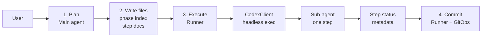
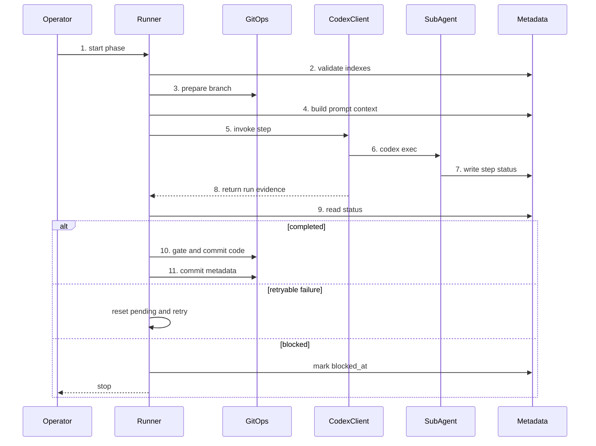
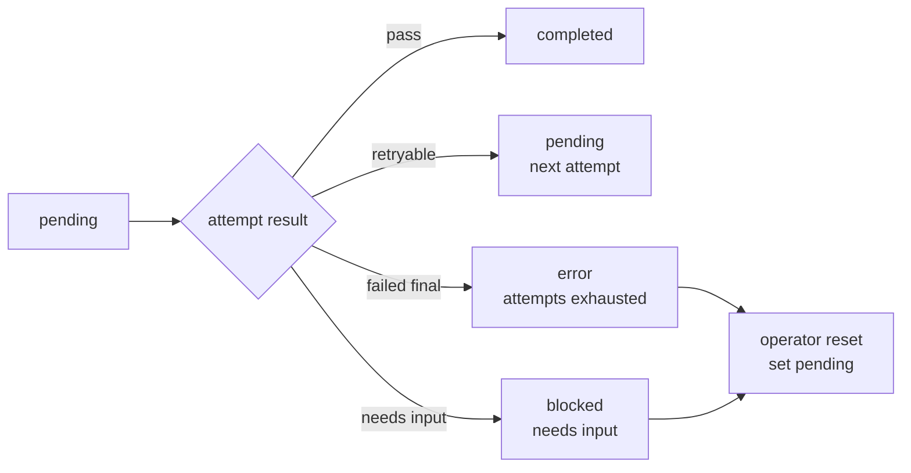
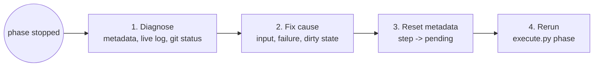

# Harness Architecture

이 문서는 SolveSync 저장소에서 Codex Harness 작업을 계획, 실행, 복구하는 구조를 설명한다. SolveSync 제품 아키텍처 문서가 아니다. 제품 범위, runtime 동작, UI 규칙, extension 검증 절차는 기존 `docs/` 제품 문서를 따른다.

대상 독자는 다음과 같다:

- 새 phase를 설계하는 human 또는 main agent,
- `scripts/execute.py`를 실행하는 operator,
- 독립 step을 수행하는 sub-agent,
- harness runner를 수정하는 maintainer.

## Core Concepts

Harness는 큰 구현 요청을 추적 가능한 phase로 만들고, phase를 독립 실행 가능한 step으로 나눈다.

| Concept | Meaning |
| --- | --- |
| Main agent | 사용자와 대화하고, 문서를 읽고, phase와 step을 설계하는 현재 Codex session. |
| Operator | `scripts/execute.py`를 실행하고 recovery 결정을 내리는 human 또는 main agent. Sub-agent는 operator가 아니다. |
| Phase | `phases/{N-slug}/` 아래에 있는 하나의 작업 단위. |
| Step | fresh headless Codex session이 실행하는 최소 작업 단위. |
| Runner | `scripts/execute.py`로 시작되는 Python orchestration. |
| CodexClient | Runner 안에서 `codex exec --json`, live log, timeout, retry detail을 담당하는 process adapter. |
| Sub-agent | Runner가 step 하나를 맡기기 위해 호출하는 headless Codex session. |
| GitOps | `scripts/harness/git_ops.py`의 git boundary. dirty check, branch, commit, push, quality gate를 담당한다. |
| Metadata | `phases/index.json`, `phases/{phase}/index.json`; 진행 상태의 source of truth. |
| Live log | `phases/{phase}/stepN-live.log`; retry와 recovery를 위한 실행 증거. |
| Prompt Context | Runner가 sub-agent prompt 앞에 붙이는 실행 context. |

Runner와 main agent는 같은 역할이 아니다. Main agent는 계획을 만들고 사용자와 결정한다. Runner는 그 계획을 파일에서 읽어 실행한다. CodexClient는 Runner 내부의 process adapter이고, Sub-agent는 CodexClient가 띄우는 step 단위 headless Codex session이다.

Step마다 headless Codex session을 새로 쓰는 이유는 context를 격리하기 위해서다. 각 step은 이전 chat에 기대지 않고 Runner가 주입한 prompt context만 보고 실행해야 한다. 이렇게 해야 retry와 recovery가 기억이 아니라 metadata와 live log에 근거한다.

## Prompt Context

Runner가 sub-agent에게 전달하는 prompt context는 다음 네 가지로 구성된다.

| Part | Scope and lifetime |
| --- | --- |
| Guardrails | `AGENTS.md`와 sorted `docs/*.md`. 모든 step attempt에 주입된다. 하위 `docs/adr/`나 `docs/harness/adr/`는 step file이 읽도록 지시해야 한다. |
| Previous summaries | 현재 phase에서 `completed` 상태이고 `summary`가 있는 모든 이전 step. 전체 diff나 live log가 아니라 한 줄 summary만 전달된다. |
| Retry detail | 같은 Runner process에서 바로 직전 attempt가 실패했을 때만 추가된다. previous error, live log path, observed commands, stderr tail을 포함한다. |
| Step file | 현재 `phases/{phase}/stepN.md` 본문. sub-agent의 실제 작업 범위와 acceptance criteria를 정의한다. |

## Repository Layout

Harness 관련 파일은 다음 위치에 모인다.

```text
.
├── scripts/
│   ├── execute.py
│   ├── harness/
│   │   ├── codex_client.py
│   │   ├── git_ops.py
│   │   ├── phase_index.py
│   │   └── runner.py
│   ├── harness_self_test.py
│   └── harness_tests/
├── phases/
│   ├── index.json
│   └── {N-slug}/
│       ├── index.json
│       ├── step0.md
│       └── step0-live.log
└── docs/
    └── harness/
        ├── harness_architecture.md
        └── adr/
```

`stepN-live.log`는 active, failed, blocked step의 실행 증거다. 성공적으로 finalize된 step의 live log는 Runner가 삭제한다.

## Visual Overview



## Responsibility Boundaries

Harness는 계획, 실행, 구현, git history를 분리한다.

| Owner | Responsibility |
| --- | --- |
| Main agent | 문서를 탐색하고 사용자 의도를 정리해 phase/step 파일을 설계한다. |
| Operator | Runner 실행, 중단 원인 확인, recovery metadata reset 여부를 결정한다. |
| Runner | metadata 검증, step 실행, retry, finalize, 요청 시 push를 담당한다. |
| CodexClient | Codex process 실행, live log stream, timeout, retry detail 생성을 담당한다. |
| Sub-agent | 현재 step 구현, acceptance criteria 실행, step status 업데이트를 담당한다. |
| GitOps | dirty check, branch 관리, commit 분리, quality gate 실행을 담당한다. |

Sub-agent는 commit하지 않는다. Runner가 sub-agent가 기록한 status를 읽고 code change와 metadata change를 commit한다.

## User Journey

### 1. Plan Phase

**상황:** 큰 구현 작업을 작은 실행 단위로 나눠야 한다.

**목표:** 각 step이 fresh Codex session에서 독립 실행될 수 있는 phase를 만든다.

**흐름:**

1. `AGENTS.md`와 관련 `docs/` source-of-truth 파일을 읽는다.
2. scope, success criteria, 미결정 지점을 정리한다.
3. 작업을 layer 또는 module 기준으로 나눈다.
4. `phases/index.json`에 phase를 등록한다.
5. `phases/{phase}/index.json`에 pending step 목록을 만든다.
6. 각 `stepN.md`에 읽을 파일, 작업, acceptance criteria, 검증, 명시적 경고를 적는다.

**성공 상태:** 모든 step이 이전 chat에 의존하지 않고 실행될 만큼 충분한 context를 가진다.

### 2. Execute Phase

**상황:** phase 파일이 준비되었고 구현을 Runner에 위임하려 한다.

**목표:** pending step을 순서대로 실행하고 code와 metadata를 일관되게 commit한다.

**흐름:**

1. `python3 scripts/execute.py {phase-dir}`를 실행한다.
2. Runner가 top index와 phase index 정합성을 검증한다.
3. Runner가 unrelated dirty worktree 상태를 차단한다.
4. Runner가 `feat-{phase}` branch를 checkout하거나 생성한다.
5. Runner가 sub-agent prompt context를 만든다.
6. CodexClient가 `codex exec --json`으로 sub-agent 하나를 호출한다.
7. Runner가 step status를 읽고 commit, retry, stop 중 하나를 결정한다.

**성공 상태:** 모든 step이 `completed`가 되고, phase metadata가 finalize되며, commit은 Runner가 만든다.

### 3. Retry Failed Step

**상황:** Sub-agent가 step을 완료하지 못하고 종료했거나 `error`를 기록했다.

**목표:** 다음 attempt가 실패 원인을 볼 수 있게 증거를 남기고, attempt가 소진되면 명확한 `error` 상태로 멈춘다.

**흐름:**

1. Codex가 종료되면 Runner가 현재 step status를 다시 읽는다.
2. Step이 `completed`가 아니면 CodexClient가 retry detail을 만든다.
3. Retry detail에는 previous error, live log path, observed commands, stderr tail이 들어간다.
4. Attempt가 남아 있으면 Runner가 step을 `pending`으로 되돌리고 다음 attempt를 호출한다.
5. Attempt가 소진되면 Runner가 `error_message`와 `failed_at`을 기록한다.
6. Top-level phase status는 `error`가 된다.

**성공 상태:** Retry 중 step이 완료되거나, 복구 판단에 필요한 실패 증거가 metadata에 남는다.

### 4. Recover Phase

**상황:** Blocker, timeout, failed attempts, runner kill, dirty worktree 때문에 phase가 멈췄다.

**목표:** Runner가 다시 읽고 재개할 수 있는 metadata 상태로 복구한다.

**흐름:**

1. `phases/{phase}/index.json`을 확인한다.
2. `stepN-live.log`가 있으면 확인한다.
3. `git status --porcelain`으로 dirty state를 확인한다.
4. 실패 command, missing input, auth issue, unrelated dirty state 같은 실제 원인을 해결한다.
5. 관련 step을 `pending`으로 되돌린다.
6. `error_message` 또는 `blocked_reason`을 삭제한다.
7. `python3 scripts/execute.py {phase-dir}`를 다시 실행한다.

**성공 상태:** 같은 Runner 경로가 다음 pending step부터 재개한다.

## Data Model

`phases/index.json`은 phase registry다. 각 entry는 `dir`과 `status`를 가진다. `dir`은 `N-slug` 형식을 쓰며, `N`은 registry의 0-based 순서와 일치해야 한다.

```json
{
  "phases": [
    { "dir": "0-mvp-extension", "status": "completed" },
    { "dir": "1-programmers-support", "status": "completed" },
    { "dir": "9-harness-docs", "status": "pending" }
  ]
}
```

`phases/{phase}/index.json`은 phase의 상세 상태다.

```json
{
  "project": "SolveSync",
  "phase": "9-harness-docs",
  "steps": [
    { "step": 0, "name": "terminology", "status": "pending" },
    { "step": 1, "name": "render-review", "status": "pending", "timeout_sec": 3600 }
  ]
}
```

각 step은 다음 필드를 가진다.

| Field | Meaning |
| --- | --- |
| `step` | 0부터 시작하는 연속 번호. |
| `name` | kebab-case step slug. |
| `status` | `pending`, `completed`, `error`, `blocked`. |
| `summary` | `completed` step에 필요한 한 줄 산출물 요약. 이후 step prompt에 전달된다. |
| `error_message` | 실패한 attempt 또는 최종 `error` 상태의 실패 증거. |
| `blocked_reason` | 사용자 입력이나 외부 상태가 필요한 이유. |
| `max_attempts` | Optional retry override. 기본값은 `3`. |
| `timeout_sec` | Optional Codex execution timeout override. 기본값은 `1800`. |

`max_attempts`와 `timeout_sec`의 기본값 출처는 `scripts/harness/phase_index.py`다. 이 값은 product rule이 아니라 runner tuning default다. 일반 step은 기본값을 쓰고, 무거운 validation step처럼 실행 시간이 길거나 재시도 정책을 다르게 잡아야 할 때만 override한다.

`stepN.md`는 sub-agent에게 전달되는 작업 지시서다. 최소 skeleton은 다음과 같다.

````markdown
# Step {N}: {kebab-case-name}

## 읽을 파일

- `AGENTS.md`
- `docs/ARCHITECTURE.md`
- `docs/adr/`
- {이 step에 필요한 파일}

## 작업

{현재 step의 구체적인 작업 범위}

## 인수 기준

```bash
npm run typecheck
npm test
npm run build
```

## 검증

1. 인수 기준 command를 실행한다.
2. 변경 파일이 step scope 안에 있는지 확인한다.
3. `phases/{phase}/index.json`의 현재 step status를 업데이트한다.

## 하지 말 것

- `git commit`을 실행하지 말 것. Runner가 step commit을 만든다.
- step scope 밖 파일을 수정하지 말 것.
````

## Execution Flow



이 flow의 핵심은 세 가지다. Runner는 깨진 phase 파일과 unrelated dirty state를 실행 전에 막는다. Sub-agent는 주입된 prompt context만 보고 작업한다. Retry와 recovery는 live log와 metadata를 기준으로 판단한다.

## Step Status Rules

Step status는 sub-agent와 Runner 사이의 계약이다. Sub-agent는 결과를 metadata에 기록하고, Runner는 metadata를 읽어 다음 행동을 결정한다.

| Status | When to use | Runner behavior |
| --- | --- | --- |
| `pending` | 아직 실행하지 않았거나 다음 attempt로 되돌릴 수 있는 상태. | 다음 pending step을 실행한다. |
| `completed` | Step scope 구현과 acceptance criteria가 끝났고 `summary`를 남긴 상태. | `completed_at`을 기록하고 code change와 metadata를 commit한다. |
| `error` | 현재 attempt에서 해결하지 못했지만 retry로 해소될 가능성이 있는 실패. | attempt가 남으면 `pending`으로 되돌리고 retry한다. 소진되면 `failed_at`과 최종 `error_message`를 기록한다. |
| `blocked` | 사용자 결정, 인증, secret, 외부 상태처럼 retry만으로 풀 수 없는 입력이 필요한 상태. | `blocked_at`을 기록하고 retry 없이 중단한다. |

`max_attempts`가 소진되어도 Runner가 자동으로 `blocked`로 바꾸지는 않는다. `blocked`는 sub-agent가 명시적으로 `blocked_reason`을 썼을 때만 발생한다. Timeout, non-zero Codex exit, status 미갱신은 retryable failure로 취급되며 attempt가 소진되면 `error`가 된다.



## Partial Failure And Concurrency

Runner는 failed attempt가 만든 파일 변경을 자동으로 reset하지 않는다. 같은 `execute.py` process 안에서 retry가 이어지면 다음 attempt는 이전 attempt의 partial changes와 retry detail을 함께 본다.

Runner가 `error` 또는 `blocked`로 멈춘 뒤에는 다르다. 다음 rerun의 dirty preflight는 current phase metadata인 `phases/index.json`과 `phases/{phase}/index.json`만 예외로 허용한다. Code나 tooling 변경이 dirty로 남아 있으면 operator가 먼저 검토하고 정리해야 한다. Runner는 partial code가 유효한지 추론하지 않는다.

Harness는 한 worktree에서 한 phase만 실행하는 single-flight 모델이다. 별도 lock file은 없지만, branch checkout과 clean worktree preflight가 이 가정을 전제로 한다. 두 phase를 동시에 실행해야 한다면 별도 clone이나 git worktree를 사용한다.

## Sub-agent Authority Boundary

CodexClient는 현재 `codex exec --json --sandbox danger-full-access -c approval_policy="never"`로 sub-agent를 실행한다. 즉 sub-agent는 interactive approval 없이 로컬 command를 실행할 수 있다. 이 경계는 OS sandbox가 아니라 harness contract와 review policy로 관리된다.

Sub-agent가 할 수 있는 일:

- 현재 step scope 안의 파일 수정,
- step acceptance criteria 실행,
- 현재 step의 `summary`, `error_message`, `blocked_reason` 기록.

Sub-agent가 하면 안 되는 일:

- `git commit`, `git push`, branch checkout 또는 branch 생성,
- step scope 밖 파일 수정,
- unrelated dirty state 정리,
- secret, token, cookie, credential을 source, fixture, docs, log에 남기기,
- destructive cleanup으로 실패 원인을 숨기기.

사용자 입력, 인증, secret, 외부 서비스 상태, 제품 결정이 필요하면 sub-agent는 `blocked`와 `blocked_reason`을 기록하고 중단해야 한다.

## Validation And Commit Policy

Product quality gate는 SolveSync 제품 동작을 검증한다:

```bash
npm run typecheck
npm test
npm run build
```

Harness self-test는 `scripts/harness_self_test.py`와 `scripts/harness_tests/`로 runner tooling을 검증한다.

| Policy | Why |
| --- | --- |
| Feature/code change는 harness metadata와 별도 commit으로 분리한다. | 제품 변경과 진행 상태 변경을 review와 revert에서 분리하기 위해서다. |
| Product quality gate는 feature/code commit 직전에만 실행한다. | commit되는 제품 변경이 typecheck, Vitest, Vite build를 통과했는지 보장하기 위해서다. |
| Metadata-only commit 전에는 product quality gate를 실행하지 않는다. | Phase status만 바꾸는 commit은 extension runtime 동작을 바꾸지 않기 때문이다. |
| Harness self-test는 staged feature/code change가 harness-related path를 touch한 경우에만 실행한다. | Product-only 변경마다 runner test를 돌리지 않되, orchestration 변경의 regression은 막기 위해서다. |
| Commit failure와 gate failure는 hard failure다. | 실패한 검증 위에 다음 step을 쌓으면 retry와 recovery 증거가 흐려지기 때문이다. |

## Recovery Playbook



복구할 때 확인할 파일과 명령은 다음과 같다:

- Phase metadata: `phases/{phase}/index.json`
- Top-level phase status: `phases/index.json`
- Live log: `phases/{phase}/stepN-live.log`
- Dirty state: `git status --porcelain`
- Rerun command: `python3 scripts/execute.py {phase-dir}`

Status별 복구 기준은 다음과 같다:

- `error`: `error_message`와 live log를 읽고 원인을 해결한 뒤 해당 step을 `pending`으로 되돌리고 `error_message`를 삭제한다.
- `blocked`: `blocked_reason`에 적힌 사용자 입력이나 외부 상태를 해결한 뒤 해당 step을 `pending`으로 되돌리고 `blocked_reason`을 삭제한다.
- Dirty code/tooling change: operator가 변경을 검토하고 worktree를 정리한다. Rerun 시 dirty로 남아도 되는 것은 current phase metadata뿐이다.
- Runner kill 또는 비정상 중단: phase index, live log, git status를 확인하고 재개 가능한 metadata 상태로 정리한 뒤 같은 command를 다시 실행한다.

복구는 main agent가 step을 수동으로 이어서 구현하는 방식이 아니다. 같은 Runner 경로로 돌아가야 retry limit, timestamp, commit, quality gate, finalization 규칙이 유지된다.
