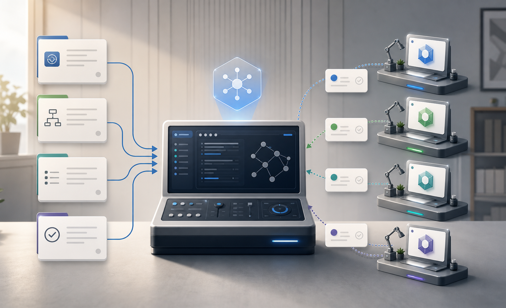
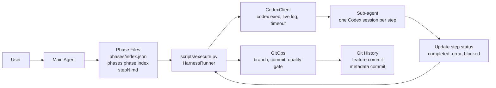
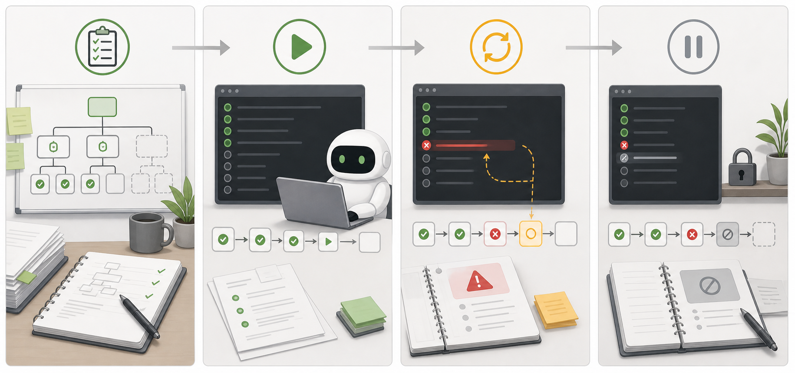
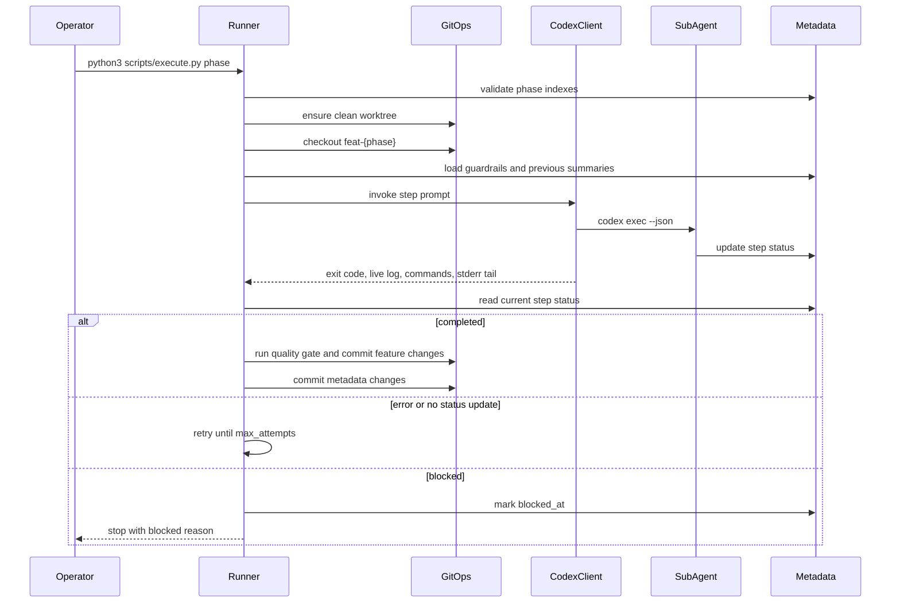
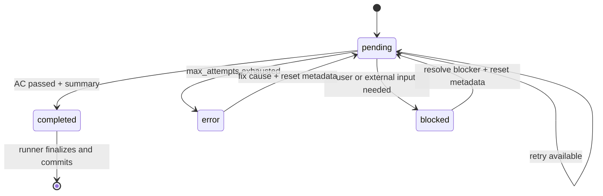

# Harness Architecture

이 문서는 SolveSync 저장소에서 Codex Harness 작업을 계획하고 실행하고 복구하는 agent orchestration 구조를 설명한다. SolveSync 제품 아키텍처 문서가 아니다. 제품 범위, runtime 동작, UI 규칙, extension 검증 절차는 기존 `docs/` 제품 문서를 따른다.

대상 독자는 다음과 같다:

- 새 phase를 설계하는 human 또는 main agent,
- `scripts/execute.py`를 실행하는 operator,
- 독립 step을 수행하는 sub-agent,
- harness runner를 수정하는 maintainer.

주요 결정의 의도와 이유는 Harness ADR을 따른다:

- [0001. Phase and Step Execution Model](./adr/0001-phase-step-execution-model.md)
- [0002. Runner-Owned Execution and Git History](./adr/0002-runner-owned-execution-and-git-history.md)
- [0003. Prompt Context and Live Log Contract](./adr/0003-prompt-context-and-live-log-contract.md)
- [0004. Validation and Dirty Recovery Policy](./adr/0004-validation-and-dirty-recovery-policy.md)

## Core Concepts

Harness는 큰 구현 요청을 추적 가능한 phase로 만들고, phase를 독립 실행 가능한 step으로 나눈다.

| Concept | Meaning |
| --- | --- |
| Main agent | 사용자와 논의하고 context를 읽고 phase를 설계하는 agent. |
| Phase | `phases/{N-slug}/` 아래에 있는 하나의 작업 단위. |
| Step | 하나의 headless Codex session이 실행하는 최소 단위. |
| Runner | `scripts/execute.py`와 `scripts/harness/*`; orchestration을 소유한다. |
| Sub-agent | step 하나를 수행하기 위해 runner가 호출하는 headless Codex session. |
| Metadata | `phases/index.json`, `phases/{phase}/index.json`; 진행 상태의 source of truth. |
| Live log | `phases/{phase}/stepN-live.log`; retry와 recovery를 위한 실행 증거. |

## Visual Overview

아래 이미지는 개념 이해를 돕기 위한 그림이다. 정확한 동작은 본문, Mermaid diagram, Harness ADR, runner source가 정의한다.





## Responsibility Boundaries

Harness는 planning, execution, implementation, git history를 분리한다.

| Owner | Responsibility | Why |
| --- | --- | --- |
| Main agent | 문서를 탐색하고 의도를 명확히 한 뒤 phase/step 파일을 설계한다. | 실행 전에 계획을 대화형으로 검토할 수 있다. |
| Runner | metadata 검증, step 실행, retry, finalize, 요청 시 push를 담당한다. | 하나의 orchestrator가 recovery와 상태 전이를 일관되게 처리한다. |
| Sub-agent | 현재 step 구현, AC 실행, step status 업데이트를 담당한다. | 각 step은 이전 chat context 없이 실행될 수 있다. |
| GitOps | dirty check, branch 관리, commit 분리, gate 실행을 담당한다. | git history와 harness metadata를 같은 규칙으로 맞춘다. |
| CodexClient | Codex 호출, log stream, timeout, retry detail 생성을 담당한다. | process 실행 책임을 phase 정책과 분리한다. |

Sub-agent는 commit하지 않는다. Runner가 sub-agent가 기록한 status를 읽은 뒤 code change와 metadata change를 commit한다.

## User Journey

아래 storyboard는 자주 쓰는 네 가지 harness 여정을 빠르게 이해하기 위한 그림이다.



### Journey 1: 새 작업을 phase로 설계한다

**상황:** 사용자 또는 main agent가 큰 구현 작업을 작은 실행 단위로 나누고 싶다.

**목표:** 각 step이 fresh Codex session에서 독립 실행될 수 있는 phase를 만든다.

**흐름:**

1. `AGENTS.md`와 관련 `docs/` source-of-truth 파일을 읽는다.
2. 사용자와 scope, success criteria, 미결정 지점을 정리한다.
3. 작업을 layer 또는 module 기준으로 나눈다.
4. `phases/index.json`에 phase를 등록한다.
5. `phases/{phase}/index.json`에 pending step 목록을 만든다.
6. 각 `stepN.md`에 읽을 파일, 작업, acceptance criteria, 검증, 명시적 경고를 적는다.

**성공 상태:** 모든 step이 이전 chat에 의존하지 않고 실행될 만큼 충분한 context를 가진다.

**의도:** step 독립성을 확보하면 이후 sub-agent가 빠진 의도를 추측하지 않아도 된다.

### Journey 2: runner로 phase를 실행한다

**상황:** phase 파일이 준비되었고 구현을 runner에 위임하려 한다.

**목표:** pending step을 순서대로 실행하고 code와 metadata를 일관되게 commit한다.

**흐름:**

1. `python3 scripts/execute.py {phase-dir}`를 실행한다.
2. Runner가 top index와 phase index 정합성을 검증한다.
3. Runner가 unrelated dirty worktree 상태를 차단한다.
4. Runner가 `feat-{phase}` branch를 checkout하거나 생성한다.
5. Runner가 guardrails, previous summaries, retry detail, `stepN.md`로 prompt를 만든다.
6. CodexClient가 `codex exec --json`으로 sub-agent 하나를 호출한다.
7. Runner가 step status를 읽고 commit, retry, stop 중 하나를 결정한다.

**성공 상태:** 모든 step이 `completed`가 되고, phase metadata가 finalize되며, commit은 runner가 만든다.

**의도:** 실행 정책을 각 sub-agent가 재구현하지 않고 runner 한 곳에 모은다.

### Journey 3: step 실패를 retry 또는 error로 처리한다

**상황:** Sub-agent가 step을 완료하지 못하고 종료했거나 error를 기록했다.

**목표:** 다음 attempt가 문제를 고칠 수 있도록 충분한 증거를 제공하고, attempt가 소진되면 명확한 error 상태로 멈춘다.

**흐름:**

1. Codex가 종료되면 runner가 현재 step status를 다시 읽는다.
2. Step이 `completed`가 아니면 CodexClient가 retry detail을 만든다.
3. Retry detail에는 previous error, live log path, observed commands, stderr tail이 들어간다.
4. Attempt가 남아 있으면 runner가 step을 `pending`으로 되돌리고 다음 attempt를 호출한다.
5. Attempt가 소진되면 runner가 `error_message`와 `failed_at`을 기록한다.
6. Top-level phase status는 `error`가 된다.

**성공 상태:** Retry 중 step이 완료되거나, 복구 판단에 필요한 실패 증거가 metadata에 남는다.

**의도:** Retry는 sub-agent 내부의 무제한 self-repair loop가 아니라 runner 정책으로 제한한다.

### Journey 4: blocked 또는 중단된 phase를 복구한다

**상황:** Blocker, timeout, failed attempts, runner kill, dirty worktree 때문에 phase가 멈췄다.

**목표:** Runner가 다시 읽고 재개할 수 있는 metadata 상태로 복구한다.

**흐름:**

1. `phases/{phase}/index.json`을 확인한다.
2. `stepN-live.log`가 있으면 확인한다.
3. `git status --porcelain`으로 dirty state를 확인한다.
4. 실패 command, missing input, auth issue, unrelated dirty state 같은 실제 원인을 해결한다.
5. 관련 step을 `pending`으로 되돌린다.
6. `error_message` 또는 `blocked_reason`을 삭제한다.
7. `python3 scripts/execute.py {phase-dir}`를 다시 실행한다.

**성공 상태:** 같은 runner 경로가 다음 pending step부터 재개한다.

**의도:** Metadata 기반 복구는 실행 모델을 audit 가능하게 유지하고, commit/gate를 우회하는 수동 이어 하기를 막는다.

## Data Model

`phases/index.json`은 phase registry다. 각 entry는 `dir`과 `status`를 가진다. `dir`은 `N-slug` 형식을 쓰며, `N`은 registry의 0-based 순서와 일치해야 한다.

`phases/{phase}/index.json`은 phase의 상세 상태다. 각 step은 다음 필드를 가진다:

- `step`: 0부터 시작하는 연속 번호,
- `name`: kebab-case step slug,
- `status`: `pending`, `completed`, `error`, `blocked`,
- optional `max_attempts`: retry override, 기본값 `3`,
- optional `timeout_sec`: Codex execution timeout override, 기본값 `1800`.

Completed step은 `summary`를 포함해야 한다. 이 summary는 이후 step prompt에 전달된다.

`stepN.md`는 sub-agent에게 전달되는 작업 지시서다. 다음 내용을 포함해야 한다:

- 읽을 파일,
- 작업 지시,
- acceptance criteria,
- 검증 checklist,
- 명시적 "하지 말 것" 경고.

`stepN-live.log`는 active 또는 failed step의 임시 증거 파일이다. 성공적으로 finalize된 step의 live log는 삭제되고, failed/blocked log는 복구를 위해 보존된다.

## Execution Flow



핵심 의도:

- Index validation은 깨진 phase 파일이 실행되는 것을 막는다.
- Dirty preflight는 사용자 변경과 runner-owned 변경이 섞이는 것을 막는다.
- Guardrail injection은 sub-agent가 chat history 없이도 repo rule을 따르게 한다.
- Previous summaries는 모든 이전 log를 재생하지 않고 완료된 step context만 전달한다.

## Step Status State Machine



Step status는 sub-agent와 runner 사이의 계약이다. Sub-agent는 결과를 metadata에 기록하고, runner는 metadata를 읽어 다음 행동을 결정한다.

## Validation And Commit Policy

Product quality gate는 SolveSync 제품 동작을 검증한다:

```bash
npm run typecheck
npm test
npm run build
```

Harness self-test는 `scripts/harness_self_test.py`와 `scripts/harness_tests/`로 runner tooling을 검증한다.

Runner commit policy:

- Feature/code change는 harness metadata와 별도 commit으로 분리한다.
- Product quality gate는 feature/code commit 직전에만 실행한다.
- Metadata-only commit 전에는 product quality gate를 실행하지 않는다.
- Harness self-test는 staged feature/code change가 harness-related path를 touch한 경우에만 실행한다.
- Commit failure와 gate failure는 hard failure다.

이 정책은 product regression check와 runner tooling check를 분리하면서, git history를 읽기 쉽게 유지한다.

## Recovery Playbook

```mermaid
flowchart TD
  Start[Runner stopped or phase failed] --> CheckIndex[Check phases/{phase}/index.json]
  CheckIndex --> Status{Last step status?}

  Status -->|error| ReadError[Read error_message and step live log]
  ReadError --> FixError[Fix cause]
  FixError --> ResetError[Set status to pending<br/>remove error_message]
  ResetError --> Rerun[Run scripts/execute.py again]

  Status -->|blocked| ReadBlocked[Read blocked_reason]
  ReadBlocked --> ResolveBlocked[Resolve user or external condition]
  ResolveBlocked --> ResetBlocked[Set status to pending<br/>remove blocked_reason]
  ResetBlocked --> Rerun

  Status -->|pending| CheckDirty[Check git status]
  Status -->|completed without finalized metadata| Rerun

  CheckDirty --> Dirty{Only current phase metadata dirty?}
  Dirty -->|yes| Rerun
  Dirty -->|no| CleanWorktree[Clean or isolate unrelated dirty files]
  CleanWorktree --> Rerun
```

복구는 main agent가 step을 수동으로 이어서 구현하는 방식이 아니라 runner 재실행으로 돌아가야 한다. Runner가 retry limit, timestamp, commit, quality gate, finalization을 소유하기 때문이다.
