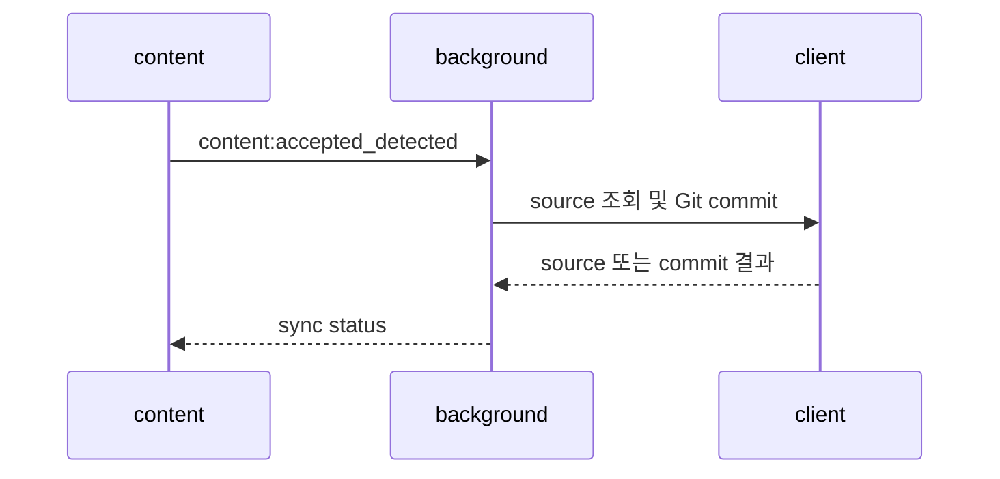

# src/background

Chrome MV3 service worker에서 sync state machine과 외부 API 경계를 소유하는 module이다.

## Owns
- sync orchestration, Coding Platform source resolver와 storage-backed deduplication lock
- settings, GitHub auth, Retry Bundle과 Sync History persistence
- `client/` 아래의 GitHub Git Data API와 LeetCode GraphQL 경계
- content, options와 popup이 사용하는 runtime message 처리

## Common changes
- sync 순서 변경 → [`sync.ts`](sync.ts)와 [`sync.test.ts`](sync.test.ts)를 먼저 바꾸고 commit 성공·실패별 storage 기록을 검증한다.
- runtime/storage 계약 변경 → [`runtime.ts`](runtime.ts), [`storage.ts`](storage.ts)와 `src/shared` 계약을 함께 갱신한다.
- 외부 API 변경 → [`client/github.ts`](client/github.ts) 또는 [`client/leetcode.ts`](client/leetcode.ts) 안에서 흡수하고 normalized error를 검증한다.

```bash
npx vitest run src/background
```



## Non-obvious
- 주의: processed Sync Deduplication Key는 GitHub commit 성공 후에만 기록한다.
- 주의: MV3 service worker의 장기 in-memory state를 source of truth로 쓰지 않는다.
- Why: service worker는 언제든 suspend될 수 있으므로 lock, history와 retry 상태가 storage에서 복구되어야 한다.

## Dependencies
- imports: `src/shared`, `src/background/client`
- imported by: extension service worker entry; `src/content`, `src/options`, `src/popup`은 runtime message로 호출
- 계약 문서: [ARCHITECTURE](../../docs/ARCHITECTURE.md), [Coding Platform 공통 계약](../../docs/platforms/README.md), [ADR 목록](../../docs/adr/README.md)
